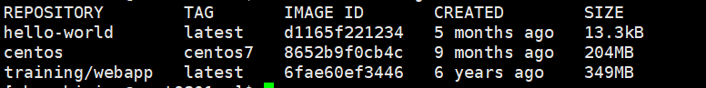
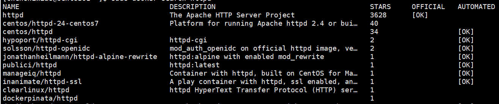

#Docker 架构
Docker 包括三个基本概念:

**镜像（Image）：**
Docker 镜像（Image），就相当于是一个 root 文件系统。比如官方镜像 ubuntu:16.04 就包含了完整的一套 Ubuntu16.04 最小系统的 root 文件系统。

**容器（Container）：**
镜像（Image）和容器（Container）的关系，就像是面向对象程序设计中的类和实例一样，镜像是静态的定义，容器是镜像运行时的实体。容器可以被创建、启动、停止、删除、暂停等。

**仓库（Repository）：**
仓库可看成一个代码控制中心，用来保存镜像。

#安装Docker
1.使用官方脚本安装
安装命令如下：

    curl -fsSL https://get.docker.com | bash -s docker --mirror aliyun

也可以使用国内 daocloud 一键安装命令：

    curl -sSL https://get.daocloud.io/docker | sh

2.手动安装
**安装 Docker Engine-Community**
使用 Docker 仓库进行安装
    在新主机上首次安装 Docker Engine-Community 之前，需要设置 Docker 仓库。之后，您可以从仓库安装和更新 Docker。

**设置仓库**

安装所需的软件包。yum-utils 提供了 yum-config-manager ，并且 device mapper 存储驱动程序需要 device-mapper-persistent-data 和 lvm2。

    $ sudo yum install -y yum-utils\device-mapper-persistent-data\lvm2
使用以下命令来设置稳定的仓库。
**阿里云**

    $ sudo yum-config-manager \--add-repo \http://mirrors.aliyun.com/docker-ce/linux/centos/docker-ce.repo

#安装 Docker Engine-Community

    $ sudo yum install docker-ce docker-ce-cli containerd.io

#启动 Docker。

    $ sudo systemctl start docker

#卸载 docker
删除安装包：

    yum remove docker-ce
删除镜像、容器、配置文件等内容：

    rm -rf /var/lib/docker
#Docker Hello World
    docker run centos:centos7 /bin/echo "Hello world"
各个参数解析：

docker: Docker 的二进制执行文件。

run: 与前面的 docker 组合来运行一个容器。

centos:centos7 指定要运行的镜像，Docker 首先从本地主机上查找镜像是否存在，如果不存在，Docker 就会从镜像仓库 Docker Hub 下载公共镜像。

/bin/echo "Hello world": 在启动的容器里执行的命令

#运行交互式的容器
    docker run -i -t centos:centos7 /bin/bash
各个参数解析：

-t: 在新容器内指定一个伪终端或终端。

-i: 允许你对容器内的标准输入 (STDIN) 进行交互。

使用exit 命令或者使用 CTRL+D 来退出容器。

-d:后台启动
后台启动时，可以使用docker ps [容器id]的方式查看正在运行的容器

#停止容器
docker stop [容器ID]or[容器名]

#运行一个 web 应用
    docker pull training/webapp
    docker run -d -P training/webapp python app.py
参数说明:

-P:将容器内部使用的网络端口随机映射到我们使用的主机上。

-p:是容器内部端口绑定到指定的主机端口。(可以指定ip)

**查看WEB应用程序容器的进程**

    docker top [容器ID]or[容器名]

**检查 WEB 应用程序**
使用 docker inspect 来查看 Docker 的底层信息。它会返回一个 JSON 文件记录着 Docker 容器的配置和状态信息。
    
    docker inspect [容器ID]or[容器名]

#Docker 镜像使用
当运行容器时，使用的镜像如果在本地中不存在，docker 就会自动从 docker 镜像仓库中下载，默认是从 Docker Hub 公共镜像源下载。

**列出镜像列表**:我们可以使用 docker images 来列出本地主机上的镜像。

各个选项说明:

REPOSITORY：表示镜像的仓库源

TAG：镜像的标签

IMAGE ID：镜像ID

CREATED：镜像创建时间

SIZE：镜像大小

**获取一个新的镜像**：当我们在本地主机上使用一个不存在的镜像时 Docker 就会自动下载这个镜像。如果我们想预先下载这个镜像，我们可以使用 docker pull 命令来下载它。

**查找镜像**：我们可以从 Docker Hub 网站来搜索镜像，Docker Hub 网址为： https://hub.docker.com/，
也可以使用 docker search 命令来搜索镜像。比如我们需要一个 httpd 的镜像来作为我们的 web 服务。我们可以通过 docker search 命令搜索 httpd 来寻找适合我们的镜像。

NAME: 镜像仓库源的名称

DESCRIPTION: 镜像的描述

OFFICIAL: 是否 docker 官方发布

stars: 类似 Github 里面的 star，表示点赞、喜欢的意思。

AUTOMATED: 自动构建。

#创建镜像
当我们从 docker 镜像仓库中下载的镜像不能满足我们的需求时，我们可以通过以下两种方式对镜像进行更改。

1、从已经创建的容器中更新镜像，并且提交这个镜像

2、使用 Dockerfile 指令来创建一个新的镜像

**更新镜像**

更新镜像之前，我们需要使用镜像来创建一个容器

    docker run -i -t centos:centos7 /bin/bash

在运行的容器内使用 yum update 命令进行更新。

在完成操作之后，输入 exit 命令来退出这个容器。

此时这个容器，是按我们的需求更改的容器。我们可以通过命令 docker commit 来提交容器副本。

    docker commit -m="更新信息" -a="[作者名]" [容器ID] [创建的镜像名]:[版本号]

#Docker Dockerfile
**什么是 Dockerfile？**

Dockerfile 是一个用来构建镜像的文本文件，文本内容包含了一条条构建镜像所需的指令和说明。

#使用 Dockerfile 定制镜像
**1、下面以定制一个 nginx 镜像（构建好的镜像内会有一个 /usr/share/nginx/html/index.html 文件）**

在一个空目录下，新建一个名为 Dockerfile 文件，并在文件内添加以下内容：

FROM nginx
RUN echo '这是一个本地构建的nginx镜像' > /usr/share/nginx/html/index.html

**2、FROM 和 RUN 指令的作用**

FROM：定制的镜像都是基于 FROM 的镜像，这里的 nginx 就是定制需要的基础镜像。后续的操作都是基于 nginx。

RUN：用于执行后面跟着的命令行命令。有以下俩种格式：

shell 格式： RUN <命令行命令>

exec 格式；RUN ["可执行文件", "参数1", "参数2"]

**注意：**
Dockerfile 的指令每执行一次都会在 docker 上新建一层。所以过多无意义的层，会造成镜像膨胀过大。

#开始构建镜像
在 Dockerfile 文件的存放目录下，执行构建动作。

以下示例，通过目录下的 Dockerfile 构建一个 nginx:v3（镜像名称:镜像标签）。

**注：**
最后的 . 代表本次执行的上下文路径

    $ docker build -t nginx:v3 .

上下文路径，是指 docker 在构建镜像，有时候想要使用到本机的文件（比如复制），docker build 命令得知这个路径后，会将路径下的所有内容打包。

**解析：**
由于 docker 的运行模式是 C/S。我们本机是 C，docker 引擎是 S。实际的构建过程是在 docker 引擎下完成的，所以这个时候无法用到我们本机的文件。这就需要把我们本机的指定目录下的文件一起打包提供给 docker 引擎使用。

如果未说明最后一个参数，那么默认上下文路径就是 Dockerfile 所在的位置。

**注意：**
上下文路径下不要放无用的文件，因为会一起打包发送给 docker 引擎，如果文件过多会造成过程缓慢。

